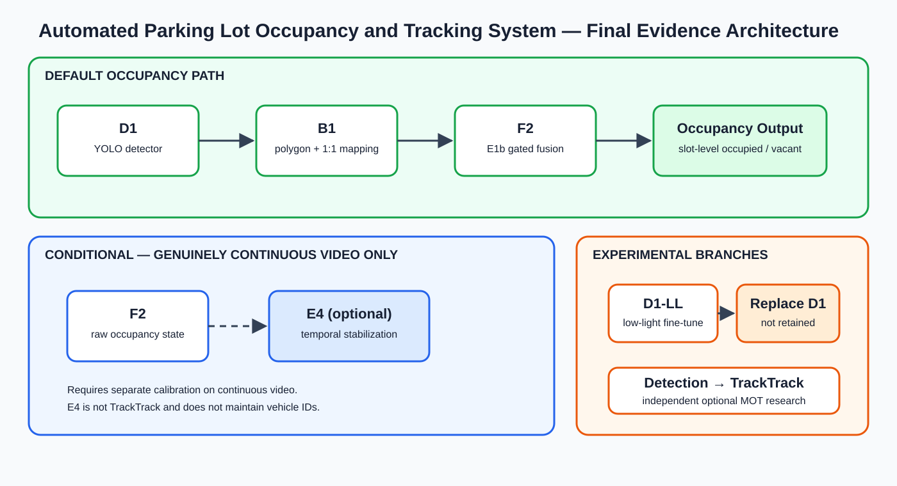

# Stage R — Stage Q-v2 Component Attribution and Final Experimental Closure

Date: 2026-07-29

Protocol: `STAGE-R-QV2-POSTHOC-COMPONENT-ATTRIBUTION-20260729-01`

Status: **POSTHOC_ANALYSIS_COMPLETE**

## Executive conclusion

Stage R independently recomputed component-level slot-occupancy metrics from
the already frozen Stage Q-v2 outputs. It ran no detector or classifier
inference, did no training, did not select or change a threshold, fusion
weight or E4 parameter, and did not regenerate E4 states. It is a post-hoc
attribution analysis of the completed Stage Q-v2 test, not a new untouched
test.

The evidence supports the final default path:

`D1 -> B1 -> F2 -> Occupancy Output`

F2 gives the strongest frozen Stage Q-v2 configuration for both D1 and
D1-LL. E4 increases occupied recall but adds substantially more
false-occupied states, reduces Macro F1 and worsens occupied-count error. E4
is therefore conditional on genuinely continuous video and requires separate
calibration. D1 remains the default detector. D1-LL remains a retained
negative low-light fine-tuning experiment.

TrackTrack is an independent optional MOT research module after detection.
It was not run in Stage Q-v2, is not E4, and has no demonstrated
slot-level occupancy benefit in this evidence.

## Frozen-input audit

The analysis required and read, but did not modify:

| Frozen input | Bytes | SHA-256 |
|---|---:|---|
| Stage Q-v2 evaluation report | 12,121 | `4197df1a7656a71af78dbef110008dfc69be0331bbb67d42ab26e9464dfb00cb` |
| Stage Q-v2 additive frozen config | 1,441 | `00d91395272a1bdd9ebe6edb0457fb5a11d1f681b9a62938b3760a55034006fc` |
| Stage Q-v2 artifact registry | 298,206 | `003bca5f2d5c6f7c92dddd99b40d2bf7f510c63dd9004a4bbd211e069e45fd21` |
| Frozen truth CSV | 174,683 | `ecce202c09182078d60c1e98b4c6f3ad1512b6ff6c4332f7ee4e68c694d636e6` |
| Frozen selected-image manifest | 72,184 | `8929e6a38b36b578ae2658127625576e632904437d0ba5d2f37470fc0b0746ba` |
| D1 `QV2-0/occupancy.csv` | 818,636 | `1cfcd41f8263c0488bbd79775dd69333ab562a272b6c00bee9f2988e135e436e` |
| D1-LL `QV2-1/occupancy.csv` | 815,384 | `b8e323c0e9d290037b78cd94e2fe728167d92026d22c7fa607ed9758568f134c` |

The Stage Q-v2 registry still verifies all 819 registered artifacts after
Stage R. The additive v2 config preserves `manifest_changed=false`,
`truth_changed=false`, `polygons_changed=false`,
`P3_parameters_changed=false`, detector/E1b weights unchanged and D1 as the
default.

Both prediction files have the same 7,896 unique
`video_id + frame_index + slot_id` keys as truth. They contain all required
fields:

`video_id`, `frame_index`, `slot_id`, `detector_occupied`, `raw_state`,
`state`, plus the frozen evidence and gate metadata.

All three prediction fields are binary. Sequence IDs cover 17 sequences,
source-frame indexes cover 376 selected frames, and slot IDs are exactly
`slot_00` through `slot_20`. `tracker_backend=none`, every `track_id` is
empty and E4 is marked enabled in the frozen output.

Truth coding was cross-checked for every row:

- canonical truth `state=1`: occupied;
- canonical truth `state=0`: vacant;
- UPM source-vector `0`: occupied;
- UPM source-vector `1`: vacant.

## Analysis definitions

| Component | Frozen prediction field | Meaning |
|---|---|---|
| R0 | `detector_occupied` | B1 polygon coverage plus one-to-one geometric mapping |
| R1 | `raw_state` | B1 plus E1b/F2 uncertainty-gated fusion, before E4 |
| R2 | `state` | B1 plus F2 plus frozen E4 temporal stabilization |

All results use the same frozen truth. Occupied-count MAE/RMSE aggregate the
number of occupied slots per selected source frame. Per-sequence count error
uses the slots in that sequence. Per-slot count error treats each slot's
binary state as its per-frame count.

## Class imbalance

The truth has 798 occupied labels (10.106%) and 7,098 vacant labels
(89.894%). Accuracy is therefore reported but is not a sufficient selection
criterion. The decision uses Macro F1, class-specific precision/recall/F1,
balanced accuracy, false-free/false-occupied rates, confusion counts and
occupied-count error.

For example, D1 R0 reaches 0.899316 accuracy while its occupied recall is only
0.194236 and false-free rate is 0.805764. That combination cannot be called a
strong occupancy result merely because most vacant labels are correct.

## Overall component results

### Class-aware metrics

| Detector | Component | Macro F1 | Occ. P | Occ. R | Occ. F1 | Vac. P | Vac. R | Vac. F1 | Accuracy | Bal. acc. | False-free | False-occ. |
|---|---|---:|---:|---:|---:|---:|---:|---:|---:|---:|---:|---:|
| D1 | R0 | 0.613207 | 0.504886 | 0.194236 | 0.280543 | 0.915272 | 0.978586 | 0.945870 | 0.899316 | 0.586411 | 0.805764 | 0.021414 |
| D1 | R1 | **0.706681** | **0.609053** | 0.370927 | **0.461059** | 0.932254 | **0.973232** | **0.952302** | **0.912361** | 0.672080 | 0.629073 | **0.026768** |
| D1 | R2 | 0.664318 | 0.368530 | **0.446115** | 0.403628 | **0.936219** | 0.914060 | 0.925007 | 0.866768 | **0.680088** | **0.553885** | 0.085940 |
| D1-LL | R0 | 0.597168 | 0.314879 | 0.228070 | 0.264535 | 0.915824 | **0.944210** | 0.929800 | 0.871834 | 0.586140 | 0.771930 | **0.055790** |
| D1-LL | R1 | **0.666978** | **0.415197** | 0.383459 | **0.398697** | 0.931275 | 0.939279 | **0.935260** | **0.883105** | **0.661369** | 0.616541 | 0.060721 |
| D1-LL | R2 | 0.617484 | 0.269572 | **0.457393** | 0.339219 | **0.933812** | 0.860665 | 0.895748 | 0.819909 | 0.659029 | **0.542607** | 0.139335 |

Bold within each detector marks the component-preferred value, not a claim
that every metric should be optimized in isolation. D1 R2 has slightly higher
balanced accuracy than D1 R1 because its occupied-recall gain narrowly
outweighs its vacant-recall loss in that arithmetic mean; its much lower
occupied precision, Macro F1 and count metrics show the operational cost.

### Confusion and occupied-count metrics

| Detector | Component | TP | TN | FP | FN | Count MAE | Count RMSE |
|---|---|---:|---:|---:|---:|---:|---:|
| D1 | R0 | 155 | 6,946 | 152 | 643 | 1.316489 | 1.797605 |
| D1 | R1 | 296 | 6,908 | 190 | 502 | **0.962766** | **1.324885** |
| D1 | R2 | 356 | 6,488 | 610 | 442 | 1.329787 | 1.736651 |
| D1-LL | R0 | 182 | 6,702 | 396 | 616 | 0.978723 | 1.443990 |
| D1-LL | R1 | 306 | 6,667 | 431 | 492 | **0.816489** | **1.158915** |
| D1-LL | R2 | 365 | 6,109 | 989 | 433 | 1.909574 | 2.337256 |

The independently recomputed Macro F1 values match the Stage R sanity
targets to better than `5e-7`; no target value was hard-coded into the
analysis.

## Absolute component contribution

All values are signed absolute changes, target minus source.

| Detector | Transition | Δ Macro F1 | Δ Occ. precision | Δ Occ. recall | Δ Vac. recall | Δ Accuracy | Δ Bal. acc. | Δ False-free | Δ False-occ. | Δ Count MAE | Δ Count RMSE |
|---|---|---:|---:|---:|---:|---:|---:|---:|---:|---:|---:|
| D1 | R0→R1 | **+0.093474** | +0.104168 | +0.176692 | -0.005354 | +0.013045 | +0.085669 | -0.176692 | +0.005354 | -0.353723 | -0.472720 |
| D1 | R1→R2 | **-0.042363** | -0.240523 | +0.075188 | -0.059172 | -0.045593 | +0.008008 | -0.075188 | +0.059172 | +0.367021 | +0.411767 |
| D1-LL | R0→R1 | **+0.069811** | +0.100318 | +0.155388 | -0.004931 | +0.011272 | +0.075229 | -0.155388 | +0.004931 | -0.162234 | -0.285074 |
| D1-LL | R1→R2 | **-0.049495** | -0.145625 | +0.073935 | -0.078614 | -0.063197 | -0.002339 | -0.073935 | +0.078614 | +1.093085 | +1.178341 |

### Error-type migration

F2 changes only detector-negative rows under the frozen gate:

- D1: 141 `FN→TP`, 38 `TN→FP`, with no reverse occupied/vacant
  transitions; net TP `+141`, FP `+38`.
- D1-LL: 124 `FN→TP`, 35 `TN→FP`; net TP `+124`, FP `+35`.

The recall recoveries dominate the small false-occupied increase. Both
detectors improve Macro F1, occupied precision/recall/F1, balanced accuracy,
accuracy and count MAE/RMSE. F2 is therefore a stable pooled improvement,
though not an improvement for every individual sequence or slot.

E4 has a different trade-off:

- D1: 70 `FN→TP` and 10 `TP→FN`, but 423 `TN→FP` and only 3 `FP→TN`;
  net TP `+60`, FP `+420`.
- D1-LL: 68 `FN→TP` and 9 `TP→FN`, but 560 `TN→FP` and only 2 `FP→TN`;
  net TP `+59`, FP `+558`.

E4 increases occupied recall and lowers false-free, but the large
false-occupied carryover reduces Macro F1 and worsens count error.

## Per-sequence and per-slot results

The complete per-sequence and per-slot tables contain every requested metric
and count in `stage_r/STAGE_R_COMPONENT_COMPARISON.csv` and JSON. The compact
tables below show Macro F1 for attribution.

F2 R0→R1 Macro F1 is improved/tied/regressed on:

| Detector | Sequences | Slots |
|---|---:|---:|
| D1 | 13 / 1 / 3 | 11 / 6 / 4 |
| D1-LL | 10 / 5 / 2 | 12 / 6 / 3 |

E4 R1→R2 Macro F1 is improved/tied/regressed on:

| Detector | Sequences | Slots |
|---|---:|---:|
| D1 | 2 / 2 / 13 | 5 / 2 / 14 |
| D1-LL | 1 / 1 / 15 | 4 / 2 / 15 |

### Per-sequence Macro F1

| Sequence | D1 R0 | D1 R1 | D1 R2 | D1-LL R0 | D1-LL R1 | D1-LL R2 |
|---|---:|---:|---:|---:|---:|---:|
| gopro1 | 0.500829 | 0.563373 | 0.538779 | 0.538000 | 0.575112 | 0.560278 |
| gopro11 | 0.611107 | 0.724190 | 0.666719 | 0.565450 | 0.702217 | 0.617439 |
| gopro12 | 0.811717 | 0.869282 | 0.729555 | 0.761477 | 0.775303 | 0.654321 |
| gopro19 | 0.475000 | 0.681013 | 0.681013 | 0.723684 | 0.723684 | 0.688889 |
| gopro23 | 0.572274 | 0.684705 | 0.683043 | 0.527423 | 0.692835 | 0.681933 |
| gopro24 | 0.552544 | 0.618433 | 0.677579 | 0.600597 | 0.614735 | 0.669359 |
| gopro25 | 0.426139 | 0.418462 | 0.410774 | 0.410774 | 0.410774 | 0.363636 |
| gopro26 | 0.782370 | 0.806810 | 0.729803 | 0.695893 | 0.695893 | 0.661190 |
| gopro30 | 0.487805 | 0.827160 | 0.487805 | 0.475000 | 0.681013 | 0.475000 |
| gopro33 | 0.472527 | 0.472527 | 0.468354 | 0.461538 | 0.461538 | 0.461538 |
| gopro34 | 0.494325 | 0.581205 | 0.590740 | 0.526474 | 0.526474 | 0.519674 |
| gopro36 | 0.820513 | 0.723684 | 0.723684 | 0.688889 | 0.633873 | 0.611111 |
| gopro4 | 0.501175 | 0.692289 | 0.633801 | 0.484669 | 0.636201 | 0.565525 |
| gopro46 | 0.576106 | 0.566832 | 0.520574 | 0.532362 | 0.527415 | 0.466151 |
| gopro5 | 0.690604 | 0.854506 | 0.779650 | 0.747449 | 0.812638 | 0.705515 |
| gopro8 | 0.753347 | 0.905399 | 0.860372 | 0.722455 | 0.868041 | 0.769863 |
| gopro9 | 0.583491 | 0.684964 | 0.546694 | 0.532631 | 0.610674 | 0.515544 |

### Per-slot Macro F1

| Slot | D1 R0 | D1 R1 | D1 R2 | D1-LL R0 | D1-LL R1 | D1-LL R2 |
|---|---:|---:|---:|---:|---:|---:|
| slot_00 | 0.497326 | 1.000000 | 0.649027 | 0.831993 | 1.000000 | 0.691803 |
| slot_01 | 1.000000 | 0.889072 | 0.692100 | 1.000000 | 0.889072 | 0.692100 |
| slot_02 | 0.871303 | 1.000000 | 0.900523 | 0.863521 | 1.000000 | 0.900523 |
| slot_03 | 0.462857 | 0.692810 | 0.720543 | 0.482387 | 0.704158 | 0.743712 |
| slot_04 | 0.465909 | 0.569935 | 0.641112 | 0.465909 | 0.569935 | 0.641112 |
| slot_05 | 0.468927 | 0.980104 | 0.895704 | 0.468927 | 0.980104 | 0.895704 |
| slot_06 | 0.455072 | 0.455072 | 0.455072 | 0.455072 | 0.455072 | 0.455072 |
| slot_07 | 1.000000 | 0.985017 | 0.844223 | 0.593091 | 0.593091 | 0.474959 |
| slot_08 | 1.000000 | 1.000000 | 0.747312 | 0.427044 | 0.427044 | 0.287967 |
| slot_09 | 1.000000 | 1.000000 | 1.000000 | 0.513733 | 0.513733 | 0.434555 |
| slot_10 | 0.486339 | 0.883302 | 0.866477 | 0.541346 | 0.751706 | 0.645212 |
| slot_11 | 0.547579 | 0.547579 | 0.694914 | 0.545619 | 0.545619 | 0.686538 |
| slot_12 | 0.430264 | 0.439384 | 0.483953 | 0.431337 | 0.440530 | 0.490449 |
| slot_13 | 0.561700 | 0.553797 | 0.405377 | 0.515548 | 0.512120 | 0.391195 |
| slot_14 | 0.920567 | 0.957151 | 0.892109 | 0.832321 | 0.957151 | 0.892109 |
| slot_15 | 0.629837 | 0.629837 | 0.604255 | 0.507236 | 0.629837 | 0.590116 |
| slot_16 | 0.706479 | 0.852027 | 0.864362 | 0.858427 | 0.872816 | 0.868326 |
| slot_17 | 0.480663 | 0.708256 | 0.672166 | 0.729957 | 0.770130 | 0.700057 |
| slot_18 | 0.476323 | 0.505559 | 0.474126 | 0.474860 | 0.502552 | 0.469676 |
| slot_19 | 0.476896 | 0.472651 | 0.423819 | 0.462089 | 0.458993 | 0.443787 |
| slot_20 | 0.462089 | 0.462089 | 0.395498 | 0.487040 | 0.487040 | 0.487040 |

## Temporal-validity audit

Only source-frame units are used. There is no reliable source FPS or
timestamp, and no result is converted to seconds.

Across 17 sequences and 376 selected frames there are 359 within-sequence
adjacent selected-frame boundaries:

| Source-frame gap | Boundary count |
|---:|---:|
| 1 | 350 |
| 2 | 1 |
| 18 | 1 |
| 41 | 1 |
| 68 | 1 |
| 82 | 1 |
| 85 | 1 |
| 97 | 1 |
| 133 | 1 |
| 136 | 1 |

There are nine `gap > 1` boundaries and the maximum gap is 136 frames.
Maximal runs whose every within-sequence source-frame gap equals one and
whose length is at least two produce 25 continuous segments covering 375
selected frames. Segment lengths are 2–29 frames, median 16 and mean 15.
The sample is still only 25 selected snippets from one shared camera
geometry, and E4 was not reset at snippet boundaries. These counts are
descriptive, not a separately regenerated temporal experiment.

Observed state changes in frozen output:

| Detector | Raw-state changes | E4 `state` changes | On gap=1 | On gap>1 | Fraction on gap>1 | `state != raw_state` rows |
|---|---:|---:|---:|---:|---:|---:|
| D1 | 146 | 97 | 81 | 16 | 0.164948 | 506 |
| D1-LL | 310 | 139 | 121 | 18 | 0.129496 | 639 |

An E4 change “on gap>1” means the current frozen `state` differs from the
previous selected state for the same sequence/slot and those selected frames
have a source-frame gap greater than one. Sixteen D1 and 18 D1-LL E4 state
changes meet that exact definition.

Sparse selection can therefore make E4 hold an old state across unobserved
source-frame intervals. Stage Q-v2 is useful for static/sparse slot
occupancy attribution but is not suitable evidence for continuous-video
temporal performance. It provides no evidence for TrackTrack because
TrackTrack was not run.

## Final method decision

1. **Default detector: D1.** D1 has higher Macro F1 than D1-LL at R0, R1
   and R2. D1-LL adds false-occupied errors and remains the frozen negative
   low-light fine-tuning experiment. Stage P2 remains `FAIL`.
2. **Default occupancy fusion: B1 + F2.** F2 gives broad, though not
   universal, per-sequence/per-slot improvements and the best pooled Macro F1
   and count error for both detectors.
3. **E4: conditional.** E4 increases occupied recall but increases
   false-occupied rate, lowers Macro F1 and worsens count error. Use only on
   genuinely continuous video after separate calibration.
4. **Static images or sparse samples: D1 + B1 + F2.** Do not carry E4 state
   across unrelated or sparsely sampled inputs.
5. **TrackTrack: independent optional MOT research.** It belongs after
   detection when vehicle identity trajectories are a research objective. It
   is not part of the default slot-occupancy path and no slot-level occupancy
   gain is claimed.

## System flow



The green path is default, blue is conditional on truly continuous video,
and orange contains experimental branches.

## Reproducibility and artifacts

Primary commands:

```powershell
.\.venv_stage_o_retinexformer\Scripts\python.exe scripts\analyze_stage_r_components.py
.\.venv_stage_o_retinexformer\Scripts\python.exe scripts\freeze_stage_r_artifacts.py
```

Generated Stage R data:

- `stage_r/STAGE_R_COMPONENT_COMPARISON.csv`: overall, per-sequence and
  per-slot metrics;
- `stage_r/STAGE_R_COMPONENT_COMPARISON.json`: complete input audit,
  comparison, deltas, errors, temporal audit and decision;
- `stage_r/STAGE_R_COMPONENT_DELTAS.csv`: R0→R1 and R1→R2 signed absolute
  changes for every scope;
- `stage_r/STAGE_R_ERROR_TRANSITIONS.csv`: TP/TN/FP/FN migration;
- `stage_r/STAGE_R_TEMPORAL_VALIDITY_AUDIT.csv`: gap, segment and state audit;
- `stage_r/STAGE_R_FINAL_SYSTEM_EVIDENCE.csv`: final evidence table;
- `stage_r/STAGE_R_SYSTEM_FLOW.svg`: default/conditional/experimental flow;
- `stage_r/STAGE_R_ARTIFACT_REGISTRY_20260729.yaml`: file sizes and SHA-256.

The additive project entry point is `FINAL_RESULTS_INDEX.md`; the prior
`literature_core/RESULTS.md` remains unchanged so the frozen Stage Q-v2
registry continues to verify.

## Validation

All commands used the existing local Python environment; no dependency was
downloaded.

| Validation command | Result |
|---|---|
| `python -m pytest tests/test_stage_r_component_attribution.py -q` | **6 passed** |
| `python -m pytest` in `implementation` | **253 passed, 3 failed** |
| `python -m pytest -k "not official_trackeval"` in `implementation` | **253 passed, 3 deselected** |
| `python -m pytest` in `implementation/literature_core` | **83 passed** |
| `python -m compileall -q src scripts tests literature_core/src literature_core/scripts literature_core/tests` | **PASS** |
| Stage Q-v2 registry verification | **819/819 verified** |
| Stage R registry verification | **13/13 verified** |
| `git diff --check` | **PASS** |

The three full-suite failures are exactly:

- `test_official_trackeval_perfect_tracking`;
- `test_official_trackeval_detects_id_switch`;
- `test_official_trackeval_counts_miss_and_false_positive`.

All fail at import with `ModuleNotFoundError: No module named 'trackeval'`.
TrackEval is an optional environment dependency. Per the frozen-project
constraint, Stage R does not install it and does not change formal tracking
or occupancy logic to hide the limitation. Every non-TrackEval
implementation test passes.

After this report was finalized, the Stage R registry was regenerated and
every registered file size and SHA-256 was recomputed and verified.
